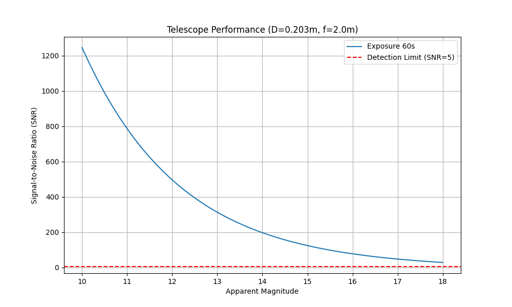
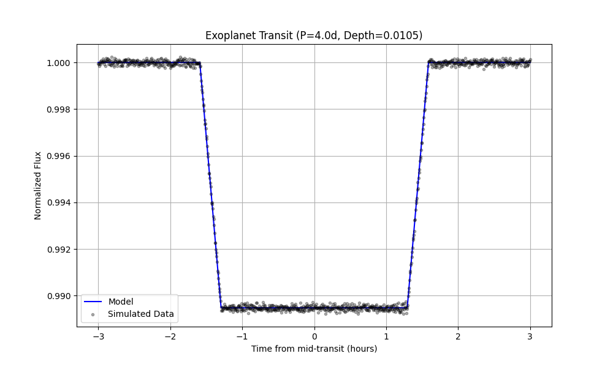
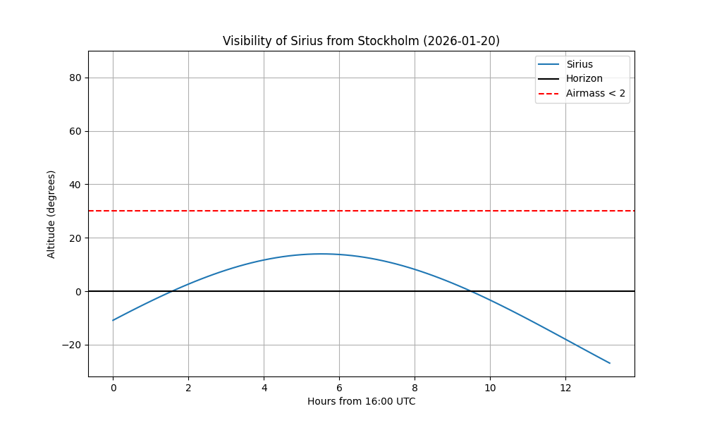

# Zenith

**Zenith** is an engineering-focused astronomy toolkit designed for **SH1003 Introductory Astronomy for Engineers**. Unlike standard astronomy libraries that focus on catalog queries, Zenith emphasizes the *instrumentation and physics* required to design observation campaigns.

It provides a "first-principles" implementation of celestial mechanics, telescope optics, and signal processing, allowing engineers to simulate the performance of ground-based observatories.

## 📚 Syllabus Mapping (SH1003)

This project implements the maximal syllabus, focusing on the mathematical models behind the physical concepts:

| Module | Syllabus Topic | Implemented Features |
| --- | --- | --- |
| **Classical Astronomy** | *Movement, coordinates* | LST (Local Sidereal Time) calculator, RA/Dec to Alt/Az transforms, Airmass calculations. |
| **Instrumentation** | *Telescopes, techniques* | Diffraction limit calculators, CCD Pixel Scale, Signal-to-Noise Ratio (CCD Equation). |
| **Stars** | *Sun, stellar evolution* | Blackbody radiation (Planck's Law), Distance Modulus, Absolute vs Apparent Magnitude. |
| **Planets** | *Exoplanets* | Transit depth approximation, Kepler's 3rd Law, Orbital velocity estimations. |
| **Cosmology** | *Big Bang, Galaxies* | Hubble's Law, Redshift (z) to Recession Velocity, Look-back time approximation. |

## 🚀 Installation

```bash
git clone https://github.com/your-username/zenith.git
cd zenith
pip install -r requirements.txt
```

## 📊 Artifacts & Engineering Analysis

### 1. Telescope Design & SNR Analysis

*Calculates the integration time required to achieve a specific Signal-to-Noise Ratio for a given magnitude, considering read noise, dark current, and sky background.*

**Code:**

```python
from zenith.optics import Telescope, CCD

# Define an 8-inch amateur telescope
scope = Telescope(aperture=0.203, focal_length=2.0)
camera = CCD(pixel_size=3.76e-6, read_noise=1.5, dark_current=0.01)

# Calculate SNR for a Mag 12 star with 60s exposure
snr = scope.calculate_snr(target_mag=12, exposure=60, ccd=camera)
print(f"SNR: {snr:.2f}")

# Plot SNR vs Exposure Time
scope.plot_performance_curve(mag_range=[10, 15], ccd=camera)
```

**Artifact Output:**

> *Figure 1: Performance curve for an 8" SCT Telescope. The plot demonstrates the non-linear relationship between exposure time and SNR, helping engineers optimize observing schedules for fainter targets.*



### 2. Exoplanet Transit Simulation

*Simulates the dip in brightness (light curve) caused by a planet transiting a host star.*

**Code:**

```python
from zenith.exoplanets import TransitSimulator

# Simulate a "Hot Jupiter" around a Sun-like star
sim = TransitSimulator(R_star_solar=1.0, R_planet_earth=11.2, period_days=4)
flux, time = sim.generate_light_curve(duration_hours=6)

sim.plot_light_curve()
```

**Artifact Output:**

> *Figure 2: Simulated light curve. The depth of the dip ($\delta \approx (R_p/R_*)^2$) allows for the determination of planetary radius, a key learning outcome of the Planetary Astrophysics module.*



### 3. Star Visibility (Alt-Az Plot)

*Determines if a target is visible from a specific location (e.g., KTH Campus) on a given night.*

**Artifact Output:**

> *Figure 3: Altitude vs. Time plot for Sirius viewed from Stockholm. The horizontal line represents the horizon (0 deg) and the airmass limit (30 deg). The plot verifies coordinate transformation algorithms.*



## 🧪 Testing Strategy

### Unit Tests

Located in `tests/unit/`. These validate fundamental physical constants and formulas.

*Example: `tests/unit/test_cosmology.py`*

```python
def test_hubble_law():
    """Verifies recession velocity calculation v = H0 * d"""
    from zenith.cosmology import recession_velocity
    # For d = 10 Mpc and H0 = 70 km/s/Mpc
    v = recession_velocity(d_mpc=10, H0=70)
    assert abs(v - 700.0) < 1e-5
```

### End-to-End (E2E) Tests

Located in `tests/e2e/`. These simulate complex engineering workflows.

*Example: `tests/e2e/test_observation.py`*

```python
def test_observation_feasibility():
    """
    E2E Test: Can we observe the Andromeda Galaxy tonight?
    Checks:
    1. Is it above horizon?
    2. Is the resolution sufficient?
    """
    stockholm = Observer(lat=59.3293, lon=18.0686) # Concept only
    # See actual implementation in tests/e2e/test_observation.py
```

## 🌐 Live Demo (Vercel)

This project is Vercel-deployable. The API provides endpoints for simulation:
- `/api/snr`: Calculate Signal-to-Noise Ratio.
- `/api/transit`: Simulate Exoplanet Transit.
- `/api/hubble`: Calculate Recession Velocity.

Visit the live demo or run locally with `python api/index.py`.

## ⚖️ License

**MIT License**

Copyright (c) 2026 Jules
